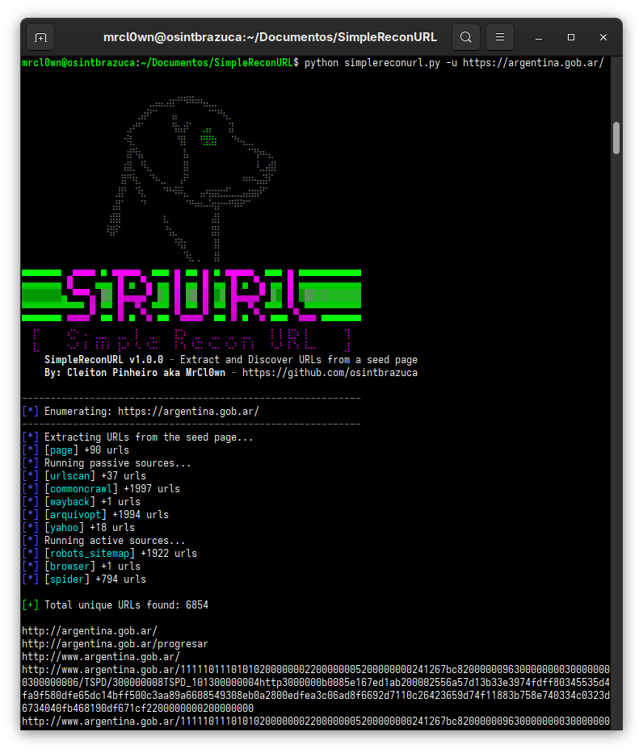
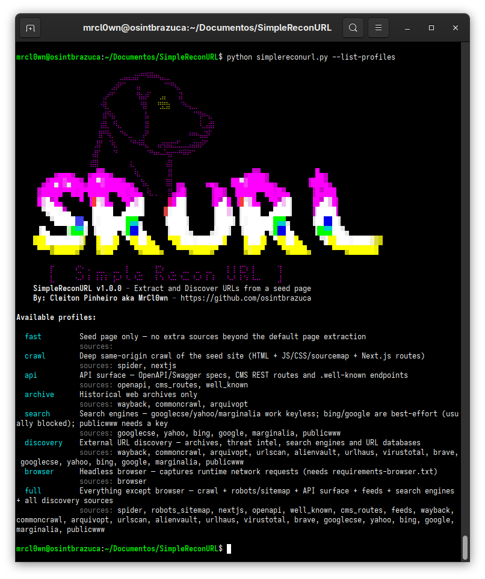
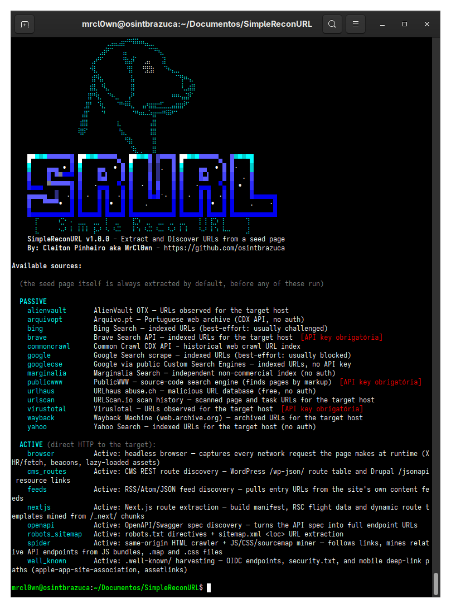
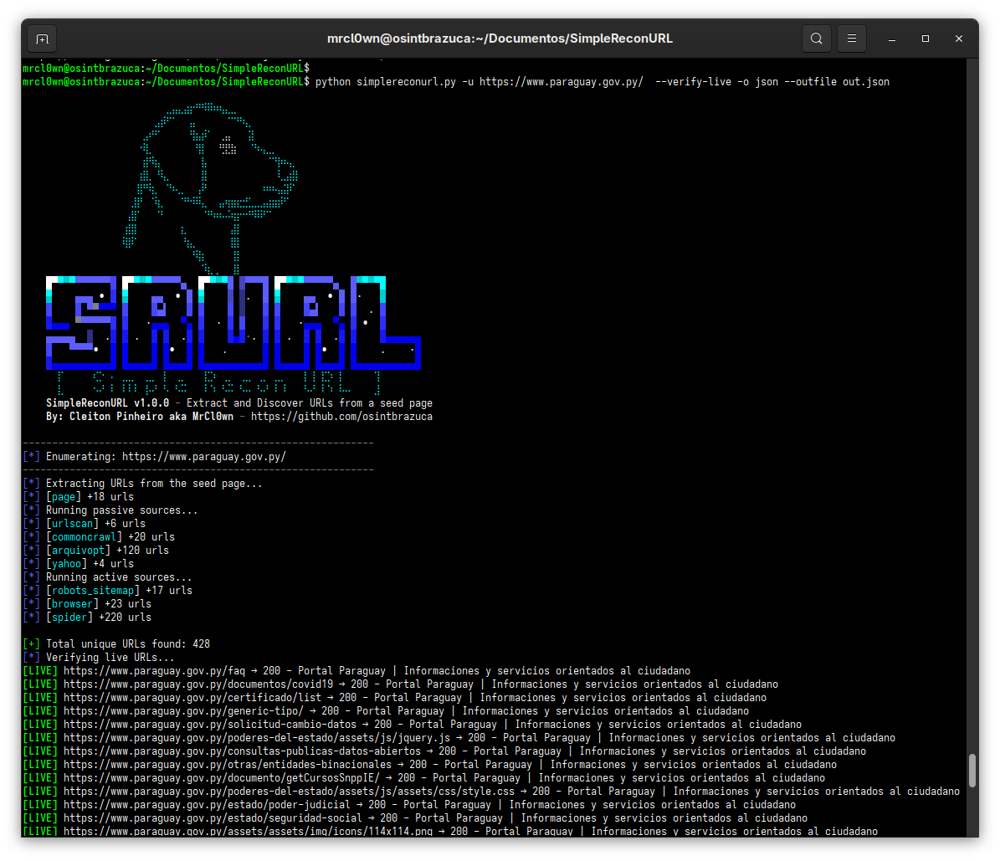
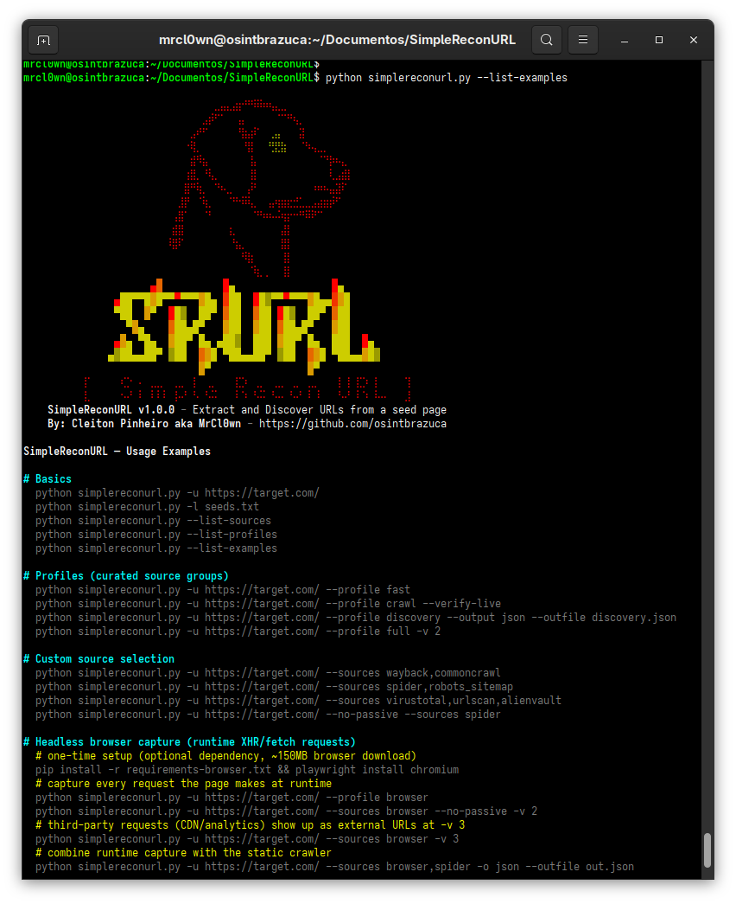

<h1 align="center">SRURL - Simple Recon URL v1.0.0</h1>

<p align="center">
  Ferramenta de extração e descoberta de URLs para fluxos de OSINT e reconhecimento
</p>

<p align="center">
<a href="README.md"></a>
<a href="README_EN.md"></a>
<a href="README_ES.md"></a>
</p>

<h1 align="center">
  <a href="#"></a>
</h1>


<p align="center">
<a href="https://www.python.org/"></a>
<a href="#"></a>
<a href="#"></a>
<a href="#"></a>
</p>

<p align="center">
<a href="https://github.com/osintbrazuca/SimpleReconURL/blob/master/LICENSE"></a>
<a href="https://github.com/osintbrazuca/SimpleReconURL/graphs/contributors"></a>
<a href="https://github.com/osintbrazuca/SimpleReconURL/issues"></a>
<a href="https://github.com/osintbrazuca/SimpleReconURL/discussions"></a>
<a href="https://github.com/osintbrazuca/SimpleReconURL/network/members"></a>
<a href="https://github.com/osintbrazuca/SimpleReconURL/stargazers"></a>
</p>

Ferramenta de extração e descoberta de URLs para fluxos de OSINT e reconhecimento.
A partir de uma única URL semente, busca o HTML e extrai todas as URLs alcançáveis daquela página: por padrão apenas a própria página, opcionalmente aprofundada com um crawler de mesma origem e enriquecida com fontes externas de descoberta (Wayback Machine, Common Crawl, urlscan.io, AlienVault OTX, URLhaus, VirusTotal).

> [!NOTE]
> Construída em Python assíncrono, sem lógica de resolução DNS e sem dependências de shell externas. Derivada do [SimpleReconSubdomain](https://github.com/MrCl0wnLab/SimpleReconSubdomain), reorientada para URLs em vez de subdomínios.

```
Author:   Cleiton Pinheiro a.k.a MrCl0wn
Blog:     https://blog.mrcl0wn.com
GitHub:   https://github.com/MrCl0wnLab
Twitter:  https://twitter.com/MrCl0wnLab
```

---

> [!CAUTION]
> **Aviso legal:** usar o SimpleReconURL para atacar alvos sem consentimento mútuo prévio é ilegal.
> É responsabilidade do usuário final obedecer a todas as leis municipais, estaduais e federais aplicáveis.
> Os desenvolvedores não assumem qualquer responsabilidade por mau uso ou dano causado por este programa.

## Índice

- [Instalação](#instalação)
- [Chaves de API](#chaves-de-api)
- [Uso](#uso)
- [Perfis](#perfis)
- [Presets de execução](#presets-de-execução)
- [Fontes](#fontes)
- [Crawler de mesma origem (spider)](#crawler-de-mesma-origem-spider)
- [Rodadas recursivas](#rodadas-recursivas)
- [Motores de busca](#motores-de-busca)
- [Extração de rotas Next.js](#extração-de-rotas-nextjs)
- [Captura por navegador headless](#captura-por-navegador-headless)
- [Extras: URLs externas](#extras-urls-externas)
- [Mapa de links: grafo JSON e visualização HTML](#mapa-de-links-grafo-json-e-visualização-html)
- [Relatório Markdown](#relatório-markdown)
- [Banco de dados: persistência SQLite](#banco-de-dados-persistência-sqlite)
- [Monitoramento contínuo (--watch)](#monitoramento-contínuo---watch)
- [Verificação de URLs vivas](#verificação-de-urls-vivas)
- [Formatos de saída](#formatos-de-saída)
- [Encadeando com outras ferramentas](#encadeando-com-outras-ferramentas)
- [Criando um novo módulo](#criando-um-novo-módulo)
- [Banners](#banners)

---

## Instalação

```bash
git clone https://github.com/osintbrazuca/SimpleReconURL
cd SimpleReconURL
pip install -r requirements.txt
```

**Dependências** (`requirements.txt`):

| Pacote | Para que serve |
|---|---|
| `httpx[socks]` | Cliente HTTP assíncrono usado por todas as fontes (`[socks]` habilita `--proxy socks5://`) |
| `beautifulsoup4` | Parsing de HTML no extrator padrão, no crawler `spider` e no `robots_sitemap` |

### Opcional: captura por navegador headless

> [!NOTE]
> A fonte `browser` precisa do Playwright e do binário do Chromium (~150MB). Ela **não**
> é necessária para o resto: sem ela, apenas essa fonte se desabilita sozinha e todo o
> restante funciona normalmente.

```bash
pip install -r requirements-browser.txt
playwright install chromium
```

Veja [Captura por navegador headless](#captura-por-navegador-headless) para o que ela faz.

### Docker

Roda sem precisar de Python instalado. Dois caminhos de build, mesma imagem, e os argumentos da CLI passam direto:

```bash
# A) a partir do código local (contexto de build = raiz do repositório)
docker build -t docker/simplereconurl -f docker/Dockerfile .

# B) direto do GitHub, sem checkout local
docker build -t docker/simplereconurl - < docker/Dockerfile.remote

# execução (o que vem depois do nome da imagem vai para o simplereconurl.py)
docker run --rm docker/simplereconurl -u https://target.com/
```

Veja [docker/README.md](docker/README.md) para as opções completas de build, persistência de resultados (volume do `--db`), log de comandos, registro do `--watch`, montagem das chaves de API e execução do agendador.

---

## Chaves de API

> [!IMPORTANT]
> As chaves ficam em `config/api_keys.json`, que está no gitignore justamente para
> não ser commitado por acidente. Nunca versione esse arquivo preenchido.

```json
{
    "alienvault_otx": "",
    "brave":          "",
    "publicwww":      "",
    "urlscan":        "",
    "virustotal":     ""
}
```

Preencha apenas as que você tiver. `alienvault_otx` e `urlscan` funcionam sem autenticação (a chave só aumenta o limite de requisições); `virustotal`, `brave` e `publicwww` exigem chave, senão a fonte não retorna nada.

**Onde obter cada chave:**

| Chave | URL |
|---|---|
| `alienvault_otx` | https://otx.alienvault.com, em Settings > API Integration |
| `urlscan` | https://urlscan.io/user/signup |
| `virustotal` | https://www.virustotal.com/gui/join-us |
| `publicwww` | https://publicwww.com/api.html (a exportação de URLs exige plano pago) |
| `brave` | https://brave.com/search/api/ (tem tier gratuito) |

---

## Uso

### Básico

```bash
# URL semente única (o esquema é opcional, assume https://)
python simplereconurl.py -u https://target.com/

# Lista de URLs semente
python simplereconurl.py -l seeds.txt

# Listar as fontes disponíveis
python simplereconurl.py --list-sources

# Listar os perfis disponíveis (grupos de fontes prontos)
python simplereconurl.py --list-profiles

# Imprimir exemplos de uso embutidos e sair
python simplereconurl.py --list-examples

# Rodar um perfil pronto (sem precisar escrever a lista de fontes)
python simplereconurl.py -u https://target.com/ --profile crawl
python simplereconurl.py -u https://target.com/ --profile discovery --verify-live
```



### Exemplos em contexto de OSINT

**Bug bounty: mapear a superfície externa de uma página**
```bash
python simplereconurl.py -u https://target.com/ \
  --profile discovery --output json --outfile target_urls.json
```

**Crawl profundo de um site (apenas mesma origem)**
```bash
python simplereconurl.py -u https://target.com/ \
  --sources spider,robots_sitemap \
  --verify-live \
  --output json --outfile crawl.json
```

**Pipeline completo: página semente + crawl + descoberta + verificação de vivas**
```bash
python simplereconurl.py -u https://target.com/ \
  --profile full --verify-live \
  --output json --outfile full.json
```

**Modo silencioso: mandar as URLs direto para outra ferramenta**
```bash
python simplereconurl.py -u https://target.com/ --no-banner | httpx -silent
```

**Descoberta de ativos a partir de uma lista de URLs semente**
```bash
python simplereconurl.py -l scope.txt --output json --outfile all_urls.json --timeout 60
```

### Todas as flags

```
Alvo:
  -u URL                 URL semente única (esquema opcional, assume https://)
  -l FILE                Arquivo com uma URL semente por linha
  --stdin                Lê URLs semente da entrada padrão (uma por linha); permite uso em pipe

Saída:
  -o {txt,json,csv,ndjson,html,markdown}
                         Formato de saída (padrão: txt).
                         ndjson   = uma linha JSON compacta por URL, ideal para jq
                         html     = mapa de links interativo (vis-network via CDN)
                         markdown = relatório de reconhecimento legível
  --outfile FILE         Grava a saída em arquivo
  --network-map          Inclui o grafo de links (nós/arestas) na saída JSON.
                         Ativado automaticamente com -o html ou --network-html.
  --network-html FILE    Grava a visualização HTML do mapa de links em FILE, junto
                         da saída principal. Combina com qualquer -o.
  --db FILE              Banco de resultados por alvo: persiste a execução e serve de
                         base de comparação. Guarda as URLs descobertas (com a fonte e,
                         em -v 3, as URLs externas). O log de comandos fica em config/system.db.
  --db-news              Exibe e salva apenas valores inéditos em relação ao --db (exige --db)
  --db-list TYPE         Lista e sai: urls | extras (do --db) ou history
                         (de config/system.db, sem --db). Aceita filtro -u.

Monitoramento:
  --watch-add CRON       Registra o comando atual (sem o --watch-add) em config/system.db
                         numa agenda cron de 5 campos (ex.: "0,15,30,45 * * * *").
  --watch                Roda o daemon do agendador: a cada minuto dispara em paralelo os
                         jobs vencidos (imprime cada comando). Não precisa de --db; Ctrl-C encerra.
  --watch-list           Lista os jobs registrados com seus IDs e sai.
  --watch-del ID         Remove o job de agendamento com o ID informado (visto no --watch-list).
  --watch-clear          Remove todos os jobs de agendamento e sai.

Desempenho:
  -t N                   Multiplicador de concorrência do --verify-live (padrão: 8)
  --timeout N            Timeout HTTP em segundos (padrão: 30)
  --rate-limit N         Máximo de requisições HTTP simultâneas por fonte (0 = ilimitado)

Rede:
  --proxy URL            Encaminha todas as requisições HTTP por um proxy
                         (ex.: http://127.0.0.1:8080 ou socks5://host:port)
  --user-agent UA        Sobrescreve o User-Agent de todas as requisições das fontes

Controle de fontes:
  --profile PROFILE      Roda um grupo de fontes pronto (fast, crawl, discovery, full).
                         Tem precedência sobre --sources.
  --sources LIST         Fontes separadas por vírgula (padrão: todas)
  --exclude LIST         Fontes a excluir, aplicado depois de --sources/--profile
  --recursive N          Rodadas de coleta (padrão: 1, máximo: 20). Cada rodada extra
                         realimenta as URLs recém-descobertas como sementes e roda
                         todas as fontes selecionadas sobre elas. Nenhuma fonte é
                         reexecutada sobre uma entrada que ela já processou.
  --recursive-max-seeds N
                         Teto de URLs novas promovidas a semente por rodada
                         (padrão: 500, 0 = sem teto). Assets não são promovidos.
  --no-passive           Pula as fontes passivas de descoberta; a extração padrão da página
                         e as fontes ativas (spider/robots_sitemap) continuam rodando
  --list-sources         Imprime todas as fontes com suas descrições e sai
  --list-profiles        Imprime todos os perfis com seus conjuntos de fontes e sai
  --list-examples        Imprime os exemplos de uso embutidos e sai

Preset de execução:
  --config FILE          Carrega valores padrão de argumentos de um arquivo JSON.
                         Só são aplicadas as chaves ausentes na linha de comando;
                         flags explícitas sempre vencem.
                         Modelo: config/run_config.example.json

Pós-processamento:
  --verify-live          Sonda cada URL descoberta: status HTTP, título, servidor,
                         content-length, hash do corpo e tempo de resposta

Exibição:
  -v [LEVEL]             Nível de verbosidade 1 a 4 (1=resultados zerados, 2=+códigos HTTP,
                         3=+corpo +extras (URLs externas), 4=+exceções)
  -q, --quiet            Só resultados; suprime todas as mensagens de processo
  --no-banner            Suprime o banner e toda a saída de processo (modo pipe limpo)
  --no-progress          Desativa a linha de progresso viva das rodadas do --recursive.
                         Ela só aparece quando o stderr é um terminal, então o uso
                         em pipe não muda de um jeito nem de outro.
  --no-color             Desativa as cores ANSI
```

---

## Perfis

Perfis são grupos de fontes prontos, definidos em [config/profiles.json](config/profiles.json). Use `--profile NOME` em vez de digitar listas longas em `--sources`.

```bash
python simplereconurl.py --list-profiles
python simplereconurl.py -u https://target.com/ --profile crawl
```

| Perfil | Descrição | Fontes |
|---|---|---|
| `fast` | Só a página semente, sem nenhuma fonte além da extração padrão | *(nenhuma)* |
| `crawl` | Crawl profundo de mesma origem no site semente | `spider`, `nextjs` |
| `api` | Superfície de API | `openapi`, `cms_routes`, `well_known` |
| `archive` | Somente arquivos históricos da web | `wayback`, `commoncrawl`, `arquivopt` |
| `search` | Motores de busca | `googlecse`, `yahoo`, `bing`, `google`, `marginalia`, `publicwww` |
| `discovery` | Descoberta externa de URLs: arquivos, threat intel e busca | `wayback`, `commoncrawl`, `arquivopt`, `urlscan`, `alienvault`, `urlhaus`, `virustotal`, `brave` |
| `browser` | Captura de runtime por navegador headless (precisa do Playwright) | `browser` |
| `full` | Tudo, exceto `browser` | crawl + robots/sitemap + superfície de API + feeds + toda a descoberta |




> [!IMPORTANT]
> O `full` é uma lista explícita de fontes, e não `"all"`, justamente para que a fonte `browser`, que exige um download opcional de ~150MB, nunca rode de forma implícita. Chame-a por `--profile browser` ou `--sources browser`. Ao criar uma fonte nova e querer que ela entre no `full`, adicione-a à lista em [config/profiles.json](config/profiles.json).

Para adicionar ou editar perfis, altere o [config/profiles.json](config/profiles.json):

```json
{
  "myprofile": {
    "description": "My custom set",
    "sources": ["spider", "wayback"],
    "options": {"rate_limit": 5}
  }
}
```

---

## Presets de execução

Um preset de execução é um arquivo JSON que guarda valores padrão de argumentos, permitindo repetir varreduras sem linhas de comando quilométricas.

```bash
python simplereconurl.py -u https://target.com/ --config config/run_config.example.json
python simplereconurl.py -u https://target.com/ --config my_scan.json
```

**Precedência (da maior para a menor):**
1. Flags explícitas na linha de comando (sempre vencem)
2. Valores do arquivo JSON do `--config`
3. Padrões embutidos do argparse

O modelo comentado em [config/run_config.example.json](config/run_config.example.json) documenta todas as chaves disponíveis.

---

## Fontes

```bash
python simplereconurl.py --list-sources
```

A página semente é **sempre** buscada e tem suas URLs extraídas primeiro. Isso não é uma fonte selecionável: é o comportamento padrão da ferramenta e não pode ser excluído por `--sources` ou `--exclude`.

### Fontes passivas

| Fonte | Exige chave | Observações |
|---|---|---|
| `wayback` | Não | API CDX do web.archive.org, URLs arquivadas sob o host da semente |
| `commoncrawl` | Não | API CDX do Common Crawl, varre os 3 índices de crawl mais recentes |
| `arquivopt` | Não | Arquivo.pt: arquivo web português, com cobertura PT/BR forte que falta ao Wayback |
| `brave` | Sim | Brave Search API, páginas indexadas por buscador (consulta `site:`) |
| `googlecse` | Não | Google via ~26 Custom Search Engines **públicos**: índice real do Google, sem chave |
| `yahoo` | Não | Yahoo Search, o único buscador grande que ainda responde `site:` sem desafio |
| `bing` | Não | Bing Search: **melhor esforço**, normalmente recebe desafio anti-bot (veja a nota abaixo) |
| `google` | Não | Scraping do google.com: **melhor esforço**, normalmente bloqueado; use `googlecse` |
| `marginalia` | Não | Marginalia: índice independente e não comercial; páginas únicas, baixo rendimento no escopo |
| `publicwww` | Sim | PublicWWW: busca no **código-fonte** das páginas, não no texto |
| `urlscan` | Opcional | Limite maior com chave; URLs de página e de task escaneadas |
| `alienvault` | Opcional | Endpoint `url_list` do AlienVault OTX |
| `urlhaus` | Não | Base de URLs maliciosas do URLhaus (abuse.ch), sem autenticação |
| `virustotal` | Sim | Relação `domains/{host}/urls` do VirusTotal |




### Fontes ativas

> [!WARNING]
> As fontes ativas enviam requisições HTTP reais **para o alvo** e ficam registradas
> nos logs dele. Use apenas onde você tem autorização.

| Fonte | Exige chave | Observações |
|---|---|---|
| `spider` | Não | Crawler BFS de mesma origem + minerador de JS/CSS/sourcemap, incluindo os **endpoints de API relativos** (`/api/v1/users`) que só existem dentro dos bundles JS |
| `robots_sitemap` | Não | Diretivas do `robots.txt` + extração recursiva dos `<loc>` do `sitemap.xml` |
| `nextjs` | Não | Extração de rotas do Next.js: build manifest, RSC flight data, rotas `[param]` e endpoints `/_next/data/` |
| `openapi` | Não | Descoberta de spec OpenAPI/Swagger, expandindo `paths{}` na superfície completa da API |
| `well_known` | Não | Coleta em `.well-known/`: endpoints OIDC, `security.txt` e paths de deep link de apps mobile |
| `cms_routes` | Não | Tabela de rotas `/wp-json/` do WordPress + `/jsonapi` do Drupal |
| `feeds` | Não | Descoberta de feeds RSS/Atom/JSON, com as URLs das entradas |
| `browser` | Não (precisa do Playwright) | Navegador headless, captura toda requisição que a página faz em runtime |

---

## Crawler de mesma origem (spider)

O `spider` parte da URL semente exata (preservando path e query) e faz um crawl em largura até profundidade 3 ou 100 páginas, seguindo `<a href>` e `<link href>`, baixando os arquivos JS de `<script src>` e seus sourcemaps, e minerando literais de URL dentro dos corpos de JS e `.map`.

Por padrão, apenas mesma origem: um link só é seguido se o host for igual ao da semente ou um subdomínio dele. Links de outra origem encontrados no caminho **não são seguidos**, mas ficam registrados e aparecem em `-v 3` e no `--db` como URLs externas, seguindo o mesmo padrão que todas as fontes usam para achados fora de escopo.

```bash
python simplereconurl.py -u https://target.com/ --sources spider -v 3
```

---

## Rodadas recursivas

Por padrão o SRURL faz uma coleta e para. Com `--recursive N` o resultado vira entrada da coleta seguinte: as URLs recém-descobertas viram sementes, todas as fontes selecionadas rodam de novo sobre elas, e o ciclo repete até N rodadas. O padrão é 1, que é exatamente o comportamento de sempre, e o máximo é 20.

```bash
# tres rodadas, com o perfil e as fontes que voce ja usa
python simplereconurl.py -u https://target.com/ --profile crawl --recursive 3

# realimentacao agressiva, com teto de sementes por rodada
python simplereconurl.py -u https://target.com/ --recursive 10 --recursive-max-seeds 200
```

Cada rodada informa quanto rendeu:

```
[*] Round 2/3: 232 new seed url(s)...
[+] Round 2/3: +1841 urls
[*] Round 3/3: 1602 new seed url(s)...
[+] Round 3/3: +403 urls

[+] Total unique URLs found: 2501 (3 round(s))
[+] 184 asset url(s) found, not crawled (-v 3 to list them)
```

### Progresso ao vivo

Uma rodada pode levar minutos. Enquanto ela roda, uma linha única é reescrita no lugar, mostrando quanto já foi coletado e quanto é novo:

```
[*] round 2/3 [######----------]  43% | tasks 128/296 | urls 1841 (+412 new) | now /blog/post-1
```

Cada contador é rotulado porque os dois medem coisas diferentes:

| Campo | O que é |
|---|---|
| `round 2/3` | rodada atual e o total pedido em `--recursive` |
| `tasks 128/296` | **execuções de fonte** concluídas e agendadas para esta rodada, não URLs |
| `urls 1841` | total único acumulado da execução inteira, somando todas as rodadas |
| `(+412 new)` | quantas dessas são inéditas **desta rodada** |
| `now /blog/post-1` | a URL sendo processada no instante |

A porcentagem é real e não estimada: a ferramenta sabe de antemão quantas execuções a rodada terá, porque monta a lista completa antes de disparar. Nada do que já está na tela é apagado, a linha usa `\r` e se reescreve sobre si mesma.

> [!TIP]
> `tasks` costuma ser bem menor que `seeds × fontes`, e isso é o dedup por camada trabalhando. As fontes de camada `host` já consultaram o domínio inteiro na rodada 1, então não voltam a rodar e contribuem com zero execuções aqui.

> [!NOTE]
> A linha vai para o **stderr**, e só quando ele é um terminal. Na prática, `python simplereconurl.py -u https://target.com/ --recursive 3 | httpx` continua mostrando o progresso na tela **e** entrega o pipe limpo, porque só o stdout foi redirecionado. Já `... > log.txt 2>&1` não gera progresso algum, evitando um arquivo cheio de lixo de terminal. Use `--no-progress` para desligar, ou `-q` que suprime tudo.

Em terminal estreito a linha degrada por prioridade: primeiro some a URL, depois a barra. Os contadores nunca somem.

### Nada é testado duas vezes

Uma URL nunca é buscada de novo em rodada posterior, e nenhuma fonte é reexecutada com uma entrada que já processou. Isso vale entre rodadas e não só dentro de uma delas.

O ponto não óbvio é que "entrada já processada" significa coisas diferentes conforme a fonte, porque as fontes não leem a mesma parte do alvo. Cada uma declara sua camada, visível na coluna `scope` do `--list-sources`:

| Camada | Fontes | Roda |
|---|---|---|
| `url` | `page`, `browser` | uma vez por URL, pois leem a página exata |
| `origin` | `spider`, `nextjs`, `openapi`, `well_known`, `cms_routes`, `feeds` | uma vez por origem, pois sondam caminhos fixos do site |
| `host` | as 15 passivas e `robots_sitemap` | uma vez por domínio, pois já consultam `*.host` de uma vez |

> [!IMPORTANT]
> Todos os módulos selecionados continuam rodando. O que a ferramenta evita é repetir uma execução cujo resultado seria idêntico. Consultar o Wayback 257 vezes com a mesma query não devolve nenhuma URL a mais, e num teste com um alvo de 61 URLs isso reduziu 1403 execuções de fonte para 151, sem perder um único resultado.

Um subdomínio novo descoberto no meio do caminho conta como origem nova, então as fontes de camada `origin` rodam de novo para ele.

### Sementes e limites

Só URLs que podem conter links viram semente. Assets são descartados por extensão (`.css`, `.js`, `.png`, `.woff2`, `.pdf` e afins), porque o extrator de página só analisa HTML. Os bundles JS continuam sendo minerados pelo `spider`, que é o módulo feito para isso.

**Esses assets não se perdem.** Eles continuam na lista de URLs do resultado, exatamente como qualquer outra descoberta; o que a ferramenta passa a informar é quais foram encontrados sem nunca terem sido visitados. Ao final aparece a contagem, e em `-v 3` a lista completa entra na saída, num bloco próprio:

```
## Extras
### External URLs (out of scope, not followed)
### Asset URLs (in scope, found but not crawled)
```

> [!TIP]
> Os dois blocos são coisas diferentes e por isso ficam separados. As externas estão **fora** do escopo e **não** constam da lista principal. Os assets estão **dentro** do escopo e **já** constam dela: a única informação nova é que não foram buscados. Por isso o bloco de assets aparece no JSON, no relatório markdown e no `--db` (tipo `url_asset`), mas nunca é anexado às saídas `csv`, `ndjson` e `txt`, onde geraria uma segunda linha para a mesma URL.

> [!WARNING]
> A recursão multiplica o tráfego enviado ao alvo. `--recursive-max-seeds` (padrão 500) limita quantas URLs novas viram semente por rodada, e vale ajustá-lo junto com `--rate-limit` antes de subir muito o N. Valor fora da faixa 1 a 20 encerra a execução com código 2, em vez de ser ajustado silenciosamente.

A recursão para sozinha quando acabam as sementes novas, mesmo que N ainda não tenha se esgotado.

---

## Motores de busca

Buscadores conhecem URLs que nenhuma outra fonte alcança: páginas linkadas apenas por sites de terceiros, que nem snapshot de arquivo nem crawl de mesma origem encontram. Todos os módulos enviam uma única consulta `site:{host}` e paginam os resultados.

```bash
python simplereconurl.py -u https://target.com/ --profile search
python simplereconurl.py -u https://target.com/ --sources googlecse,yahoo -v 1
```

**Quais realmente funcionam** (medido, não presumido):

| Fonte | Chave | Situação |
|---|---|---|
| `googlecse` | nenhuma | Funciona. Alcança o índice real do Google através de ~26 Custom Search Engines **públicos**. Rotaciona 3 por execução, já que cada um tem índice e escopo próprios. |
| `yahoo` | nenhuma | Funciona. Ainda responde `site:` sem desafio. Pagina 4 offsets, verificados como conjuntos distintos, não a mesma página repetida. |
| `marginalia` | nenhuma | Funciona. Índice independente que ninguém mais tem. Mas é uma **busca em texto livre, não `site:`**: medidos de 1 a 3 acertos no alvo a cada 20, e bloqueia após cerca de 3 consultas. Pouco volume, cobertura única. |
| `publicwww` | obrigatória | Busca no **código-fonte** das páginas em vez do texto, então acha as páginas do alvo por um trecho compartilhado (ID de Analytics, nome de bundle). A exportação de URLs exige plano pago. |
| `bing` | nenhuma | Melhor esforço. Devolveu desafio Cloudflare Turnstile e **zero** resultados nos testes, mesmo com headers de navegador. |
| `google` | nenhuma | Melhor esforço. O `google.com/search` devolveu página-casca de JavaScript com **zero** links de resultado. Use `googlecse` para cobertura do Google. |

> [!TIP]
> Para cobertura do Google, use o `googlecse`: ele alcança o índice real através de
> Custom Search Engines públicos e não depende de scraping, que hoje vem bloqueado.

O `bing` e o `google` continuam no projeto porque o bloqueio é por IP e reputação, não permanente. Eles podem funcionar de outra rede ou atrás de `--proxy`. Quando bloqueados, não contribuem com nada e nunca quebram a execução, então ver `0 new urls` vindo deles é o resultado esperado, não um defeito.

Duas notas de implementação que vale conhecer:

- **O User-Agent padrão da ferramenta é bloqueio imediato aqui.** Esses módulos rotacionam um UA realista de navegador desktop, a menos que você defina `--user-agent` explicitamente, caso em que o seu é respeitado.
- **A navegação do próprio buscador é filtrada.** Raspar uma página de resultados também recolhe os links de cabeçalho e rodapé; uma única consulta ao Bing contribuiu com 61 URLs de lixo `r.bing.com` antes de esse filtro existir. Links dentro do escopo do alvo nunca são descartados, então escanear um desses domínios continua funcionando.

---

## Extração de rotas Next.js

Uma aplicação Next.js guarda a tabela de rotas inteira dentro do bundle JS, não no HTML. Chunks minificados contêm arrays como

```js
["/[username]/[contractAddress]/[tokenId]/bid", "/admin/approve", "/settings", ...]
```

que enumeram todas as páginas do site, inclusive áreas administrativas e rotas dinâmicas linkadas de lugar nenhum.

```bash
python simplereconurl.py -u https://target.com/ --sources nextjs -v 1
python simplereconurl.py -u https://target.com/ --profile crawl      # spider + nextjs
```

O framework tem dois roteadores que expõem coisas completamente diferentes, e ambos são tratados:

| Roteador | O que entrega |
|---|---|
| **Pages Router** (legado, comum em alvos menores) | `__NEXT_DATA__` leva ao `buildId`; o `/_next/static/<buildId>/_buildManifest.js`, cujas chaves são a **tabela de rotas completa**; e os endpoints JSON `/_next/data/<buildId>/<rota>.json` por rota, frequentemente sem autenticação |
| **App Router** (Next 13+, o que a maioria dos sites usa) | RSC flight data (`self.__next_f.push`) embutido no HTML. Não há `__NEXT_DATA__` nem build manifest |

Templates de rota (`/[username]/...`, `/blog/[...slug]`) são emitidos como estão. Não são URLs buscáveis, mas são a superfície de rotas, que é justamente o ponto. Mesma decisão que o `openapi` toma para `/users/{id}`.

A detecção custa uma única requisição: se a página semente não mostra marcador `/_next/`, `__NEXT_DATA__` ou `self.__next_f`, o módulo avisa em `-v 1` e para sem sondar nada.

> [!NOTE]
> A fonte `spider` também minera paths relativos do JS e agora entende segmentos `[param]`, então pega rotas dinâmicas em qualquer framework. O `nextjs` vai além, com os artefatos específicos do framework (build manifest, buildId, endpoints `/_next/data/`). Rodar os dois rebaixa alguns chunks duas vezes, algo aceito, já que não existe cache entre fontes.

---

## Captura por navegador headless

Todas as outras fontes leem **markup ou texto estático**. A fonte `browser` abre a URL semente numa instância oculta do Chromium e registra toda requisição que a página realmente faz **em runtime**: chamadas `fetch`/XHR, scripts injetados por JS, beacons de rastreamento, recursos com carregamento tardio e handshakes de WebSocket. Nada disso existe no HTML, então nenhum parsing encontraria.

```bash
# preparação única
pip install -r requirements-browser.txt && playwright install chromium

python simplereconurl.py -u https://target.com/ --profile browser
python simplereconurl.py -u https://target.com/ --sources browser -v 2   # loga método + tipo de recurso
```

A diferença numa página cujos endpoints são chamados por JavaScript:

```
# parsing estático (--profile fast)
http://target/static-link.html

# captura por navegador (--profile browser)
http://target/
http://target/api/v1/users?page=1        <- fetch()
http://target/api/v1/config.json         <- fetch()
http://target/api/v1/late-call           <- fetch() disparado 400ms após o load
http://target/assets/injected-by-js.js   <- <script> inserido por JS
http://target/beacon.gif?t=1786253769401 <- URL gerada em runtime
http://target/static-link.html
```

Como ela se comporta:

- **Sempre headless**: a janela do navegador nunca aparece.
- **O escopo** segue a mesma regra de todas as fontes: requisições no escopo viram resultado; hosts de terceiros (CDNs, analytics, fontes tipográficas) vão para URLs externas, visíveis em `-v 3` e no `--db`.
- **Espera pelo tráfego tardio**: depois do `load`, aguarda a rede ficar ociosa (com limite, para páginas com polling ou WebSocket não travarem), e então rola a página uma vez para disparar as requisições de carregamento tardio.
- **Falha de forma suave**: timeout de navegação ou host inalcançável ainda retornam o que foi capturado antes da falha, e o navegador é sempre fechado.
- **Respeita `--timeout`, `--proxy` e `--user-agent`** como o resto da ferramenta.
- Sem o Playwright instalado, imprime uma dica de instalação e retorna vazio; nunca quebra a execução.

Não entra no `--profile full` de propósito. Veja a nota em [Perfis](#perfis).

---

## Extras: URLs externas

O nível de verbosidade **`-v 3`** revela as URLs coletadas durante a enumeração que ficam fora do host da semente, útil para mapear dependências de terceiros e entender para onde a página aponta. (O nível 3 também liga o log de prévia do corpo HTTP.)

```bash
python simplereconurl.py -u https://target.com/ --sources spider -v 3 --no-banner
```

### Saída por formato

**txt**: seção acrescentada ao final (suprimida com `--no-banner`/`--quiet`):
```
https://target.com/
https://target.com/about

# External URLs
https://accounts.google.com/o/oauth2/...
https://cdn.jsdelivr.net/npm/...
```

**json**: objeto `"extras"` no topo:
```json
"extras": {
  "urls_external": ["https://accounts.google.com/...", "https://cdn.jsdelivr.net/..."]
}
```

**ndjson**: linhas adicionais com o campo `type`:
```json
{"seed": "https://target.com/", "url": "https://cdn.jsdelivr.net/...", "type": "url_external"}
```

**csv**: linhas extras com `type` = `url_external`.

### Receitas de jq para os extras

```bash
python simplereconurl.py -u https://target.com/ --sources spider -v 3 -o ndjson \
  | jq 'select(.type == "url_external") | .url'
```

---

## Mapa de links: grafo JSON e visualização HTML

Transforma a lista plana de URLs num grafo navegável: um grafo JSON (nós + arestas) que você pode encaminhar para outras ferramentas, e uma página HTML interativa para triagem visual. O grafo é montado **inteiramente a partir de dados já coletados** na execução, sem requisições extras.

### Referência das flags: três eixos

| Flag | Papel | A saída vai para | Combina? |
|---|---|---|---|
| **`-o html`** | Formato principal de saída, substitui `txt`/`json`/`csv`/`ndjson` | `stdout` ou `--outfile` | Um `-o` por vez |
| **`--network-html FILE`** | Artefato paralelo, sempre grava a visualização HTML em `FILE` | `FILE` (qualquer caminho) | Sim, funciona junto de qualquer `-o` |
| **`--network-map`** | Injeta um bloco `"network"` (nós/arestas) na saída JSON | Dentro do documento JSON | Só faz sentido com `-o json`; ativado automaticamente por `-o html`/`--network-html` |

```bash
python simplereconurl.py -u https://target.com/ --profile full --network-map -o json --outfile out.json
python simplereconurl.py -u https://target.com/ --profile full -o html --outfile map.html
```

### Modelo do grafo

| Tipo de nó | Montado a partir de | Observações |
|---|---|---|
| `seed` | alvo da varredura | um por URL semente |
| `page` | `result.urls` | colorido por `live.status` (2xx/3xx/4xx/5xx/nenhum) |
| `external` | `extras.urls_external` (precisa de `-v 3`) | URLs fora de escopo encontradas mas não seguidas |

| Relação da aresta | Direção |
|---|---|
| `links_to` | `seed > page` |
| `links_to_external` | `seed > external` |

Isso representa "o que foi encontrado a partir desta semente", não um grafo literal de página para página; as fontes informam quais URLs encontraram, não qual página linkou qual.

### Visualizador HTML

Arquivo único e autocontido. Carrega o [vis-network](https://visjs.github.io/vis-network/) `9.1.9` de `unpkg.com` (CDN, então precisa de internet na hora de abrir). Clique num nó para ver status HTTP, título e servidor; todas as sementes de uma execução com múltiplos alvos se fundem num único grafo.

---

## Relatório Markdown

O `-o markdown` produz um relatório completo de reconhecimento num único arquivo `.md`: métricas de resumo, tabela de URLs vivas, detecção de corpos de resposta duplicados, a lista completa de URLs, os extras de URLs externas e a contribuição de cada fonte.

```bash
python simplereconurl.py -u https://target.com/ --verify-live -o markdown --outfile report.md
```

---

## Banco de dados: persistência SQLite

Persiste cada execução num arquivo SQLite, compara os achados com execuções anteriores e permite ler os dados de volta, tudo com o `sqlite3` da biblioteca padrão do Python, sem dependência extra. São **dois** armazenamentos:

- **Banco de resultados por alvo**: `--db FILE` (o caminho é escolhido por você). Guarda **apenas resultados**: as `urls` descobertas (marcadas com a fonte e campos opcionais de verificação) e os `extras` (URLs externas, em `-v 3`). Arquivos diferentes são armazenamentos independentes.
- **Banco de sistema fixo**: `config/system.db` (resolvido em relação à instalação e **nunca passado por parâmetro**). Guarda o log de histórico de comandos e os jobs do agendador `--watch`.

```bash
# Salvar a execução completa
python simplereconurl.py -u https://target.com/ --db recon.db

# Apenas o que é novo desde a última execução
python simplereconurl.py -u https://target.com/ --db recon.db --db-news

# Inspecionar o banco
python simplereconurl.py --db recon.db --db-list urls
python simplereconurl.py --db recon.db --db-list extras
python simplereconurl.py --db-list history

# Encaminhar as URLs armazenadas para outra ferramenta
python simplereconurl.py --db recon.db --db-list urls | httpx -silent
```

### Esquema

Somente inserção, indexado por `seed`.

| Tabela | Conteúdo |
|---|---|
| `urls` | URLs descobertas + fonte + campos opcionais da verificação (status, title, server, body_hash, response_ms) |
| `extras` | URLs externas (fora de escopo), salvas em `-v 3` |

---

## Monitoramento contínuo (`--watch`)

Um agendador cron embutido: registre os comandos de reconhecimento uma vez e rode um daemon que os dispara conforme a agenda. Os jobs ficam no `config/system.db` fixo, sem precisar de `cron` ou `systemd` externos.

```bash
# a cada 15 minutos, roda uma varredura de descoberta que persiste resultados e faz o diff
python simplereconurl.py -u https://target.com/ --profile discovery --db target.db --quiet \
  --watch-add "0,15,30,45 * * * *"

# roda o agendador
python simplereconurl.py --watch

# gerencia os jobs
python simplereconurl.py --watch-list
python simplereconurl.py --watch-del 3
python simplereconurl.py --watch-clear
```

---

## Verificação de URLs vivas

O `--verify-live` sonda cada URL descoberta diretamente (ela já carrega o próprio esquema; uma falha de conexão tenta de novo com o outro esquema) e registra status HTTP, título, header de servidor, content length, um hash do corpo e o tempo de resposta.

```bash
python simplereconurl.py -u https://target.com/ --verify-live -o json --outfile out.json
```

```
[LIVE] https://target.com/about → 200 - About Us
[LIVE] https://target.com/old-page → 404
```

O campo `duplicate_bodies` na saída JSON marca as URLs que compartilham o mesmo hash de corpo de resposta, útil para identificar soft-404 ou páginas de conteúdo duplicado.



---

## Formatos de saída

### Terminal (padrão)

```
------------------------------------------------------------
[*] Enumerating: https://target.com/
------------------------------------------------------------
[*] Extracting URLs from the seed page...
[*] [page] +12 urls
[*] [spider] +34 urls
[*] [wayback] +8 urls

[+] Total unique URLs found: 41

https://target.com/
https://target.com/about
https://target.com/blog/post-1
...
```

### JSON

```json
{
  "seed": "https://target.com/",
  "timestamp": "2026-05-27T14:32:01.123456",
  "total": 41,
  "urls": ["https://target.com/", "https://target.com/about"],
  "live_urls": {
    "https://target.com/about": {
      "status": 200,
      "title": "About Us",
      "server": "nginx/1.24.0",
      "content_length": 1842,
      "body_hash": "a1b2c3d4e5f6a7b8",
      "response_ms": 125
    }
  },
  "sources": {"page": 12, "spider": 34, "wayback": 8}
}
```

### CSV

```
seed,url,type,source,status,title,server,body_hash,response_ms
https://target.com/,https://target.com/about,url,spider,200,About Us,nginx/1.24.0,a1b2c3d4e5f6a7b8,125
```

### NDJSON

Uma linha JSON compacta por URL, pensada para streaming e para encadear com `jq`.

```json
{"seed": "https://target.com/", "url": "https://target.com/about", "type": "url", "source": "spider", "status": 200, "title": "About Us"}
```

```bash
# Somente URLs vivas
python simplereconurl.py -u https://target.com/ --verify-live -o ndjson | jq 'select(.status != null)'

# Extrair apenas as URLs (pronto para pipe)
python simplereconurl.py -u https://target.com/ -o ndjson | jq -r '.url'
```

### TXT

```bash
python simplereconurl.py -u https://target.com/ -o txt --outfile results/target.txt
```

### HTML: mapa de links interativo

Veja [Mapa de links](#mapa-de-links-grafo-json-e-visualização-html).

### Markdown: relatório de reconhecimento legível

Veja [Relatório Markdown](#relatório-markdown).

---

## Encadeando com outras ferramentas

### httpx, sondagem HTTP

```bash
python simplereconurl.py -u https://target.com/ --no-banner | httpx -silent -status-code -title -tech-detect
python simplereconurl.py -u https://target.com/ --no-banner | httpx -silent -mc 200
```

### nuclei, varredura de vulnerabilidades

```bash
python simplereconurl.py -u https://target.com/ --no-banner \
  | httpx -silent \
  | nuclei -t cves/ -silent
```

### katana / gau, crawling adicional

```bash
python simplereconurl.py -u https://target.com/ --no-banner | httpx -silent | katana -silent
python simplereconurl.py -u https://target.com/ --no-banner | gau --threads 10
```

### gowitness / aquatone, capturas de tela

```bash
python simplereconurl.py -u https://target.com/ --no-banner | httpx -silent | gowitness scan single
python simplereconurl.py -u https://target.com/ --no-banner | aquatone -out aquatone-report/
```

### string-x (strx): enriquecimento e automação

O [string-x](https://github.com/MrCl0wnLab/string-x) é uma ferramenta modular de automação que usa o placeholder `{STRING}`. Combina naturalmente com o SimpleReconURL via pipe.

```bash
# Sonda HTTP em todas as URLs descobertas
python simplereconurl.py -u https://target.com/ --no-banner \
  | strx -st "echo {STRING}" -module "clc:http_probe" -pm

# Extrai e-mails de cada página descoberta
python simplereconurl.py -u https://target.com/ --no-banner \
  | strx -st "curl -sk {STRING}" -module "ext:email" -pm

# Notifica no Telegram cada URL recém-descoberta
python simplereconurl.py -u https://target.com/ --db recon.db --db-news --no-banner \
  | strx -st "echo {STRING}" -module "con:telegram" -pm
```

---

## Criando um novo módulo

Todas as fontes herdam de `BaseSource`, em `sources/base.py`. Basta colocar o arquivo em `sources/passive/` ou `sources/active/`, nenhum outro arquivo precisa ser editado.

O nome da classe deve ser o **nome do arquivo com inicial maiúscula** (por exemplo, `myservice.py` vira a classe `Myservice`), e `NAME` precisa ser igual ao nome do arquivo sem o `.py`.

O `fetch(target)` de uma fonte recebe um `Target` (`target.url` é a URL completa da semente, `target.host` é o hostname em minúsculas) e devolve as **URLs** no escopo que encontrou. Sempre passe os achados brutos por `self._filter_urls(urls, target.host)`, que mantém as URLs no escopo e encaminha automaticamente as de fora para `self.extras['urls_external']`.

### Nova fonte passiva (consulta por domínio)

```python
# sources/passive/myservice.py
from sources.base import BaseSource, Target
from core.config import get_key


class Myservice(BaseSource):
    NAME = 'myservice'
    DESCRIPTION = 'My custom service'
    API_TOKEN_IS_REQUIREMENT = True

    async def fetch(self, target: Target) -> set[str]:
        api_key = get_key('myservice')
        if not api_key:
            return set()

        urls: set[str] = set()
        headers = {'Authorization': f'Bearer {api_key}'}
        async with self._make_client(headers=headers) as client:
            resp = await self._get(client, f'https://api.myservice.com/urls/{target.host}')
            if resp.status_code == 200:
                for entry in resp.json().get('data', []):
                    if entry.get('url'):
                        urls.add(entry['url'])

        return self._filter_urls(urls, target.host)
```

Adicione a chave ao `config/api_keys.json`:
```json
{ "myservice": "your-api-key-here" }
```

### Nova fonte ativa (HTTP direto)

```python
# sources/active/myactive.py
from sources.base import BaseSource, Target


class Myactive(BaseSource):
    NAME = 'myactive'
    DESCRIPTION = 'Active: custom URL probe'
    API_TOKEN_IS_REQUIREMENT = False

    async def fetch(self, target: Target) -> set[str]:
        urls: set[str] = set()
        try:
            async with self._make_client(verify=False) as client:
                resp = await self._get(client, target.url)
                # ... parse resp.text for URLs ...
        except Exception as e:
            self._log_exc(e)
        return self._filter_urls(urls, target.host)
```

---

## Banners

A arte de inicialização é sorteada **aleatoriamente** a cada execução, seguindo o mesmo esquema do [string-x](https://github.com/MrCl0wnLab/string-x). Cada banner é um arquivo `.txt` em [core/banner/asciiart/](core/banner/asciiart/), e abaixo dele é impresso um rodapé fixo com nome da ferramenta, versão e links do autor.

Para adicionar um banner, basta colocar um `.txt` naquele diretório. Nada mais precisa ser editado:

```bash
cp my-art.txt core/banner/asciiart/
```

Regras para os arquivos de banner:

- **ANSI cru, não markup do Rich.** As cores precisam estar embutidas como códigos de escape reais (`ESC[0;91m ... ESC[0m`). Essa é a única diferença deliberada em relação ao string-x, que guarda tags `[color]...[/color]` e as renderiza pela biblioteca `rich`. Aqui os arquivos são impressos como estão, então o projeto não precisa de dependência extra. Com `--no-color` (ou quando a saída vai para um pipe), os escapes são removidos automaticamente.
- **Dois placeholders** são substituídos na hora da exibição, ambos vindos de [core/settings.py](core/settings.py):

  | Placeholder | Vira |
  |---|---|
  | `[VERSION]` | `1.0.0` |
  | `[DESCRIPTION]` | `Extract and discover URLs from a seed page` |

- Mantenha a arte razoavelmente estreita; não existe filtro por largura de terminal, então arte muito larga quebra em terminais estreitos.

Onde o banner aparece:

| Comando | Banner |
|---|---|
| Execução normal, `--help`/`-h`, `--list-sources`, `--list-profiles`, `--list-examples`, chamada sem argumentos | sim |
| `-q` / `--quiet` / `--no-banner` (qualquer comando) | não |
| `--db-list` | não, porque ele emite linhas de dados prontas para pipe, e assim continua seguro para `\| httpx` |

Diretório de banners ausente, vazio ou ilegível não é erro: a ferramenta apenas imprime o rodapé sozinho e segue em frente.



---

## 📄 LICENÇA

Este projeto está licenciado sob a Licença Apache. Veja o arquivo [LICENSE](LICENSE) para detalhes.

## 👨‍💻 AUTOR

**MrCl0wn**
- 🌐 **Blog**: [http://blog.mrcl0wn.com](http://blog.mrcl0wn.com)
- 🐙 **GitHub**: [@MrCl0wnLab](https://github.com/MrCl0wnLab)
- 🐦 **Twitter**: [@MrCl0wnLab](https://twitter.com/MrCl0wnLab)
- 📧 **Email**: mrcl0wnlab\@\gmail.com


---

## Contribuições ✨ <a name="contribuicoes"></a>

Contribuições de qualquer tipo são bem-vindas!

<a href="https://github.com/osintbrazuca/SimpleReconURL/graphs/contributors">
  
</a>
    
---

---

<div align="center">

**⭐ Se este projeto foi útil, considere dar uma estrela!**

**💡 Sugestões e feedbacks são sempre bem-vindos!**

**💀 Hacker Hackeia!**

</div>
